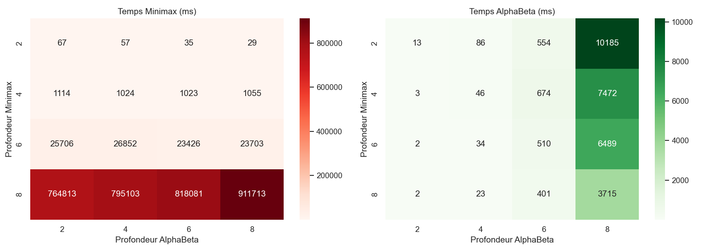
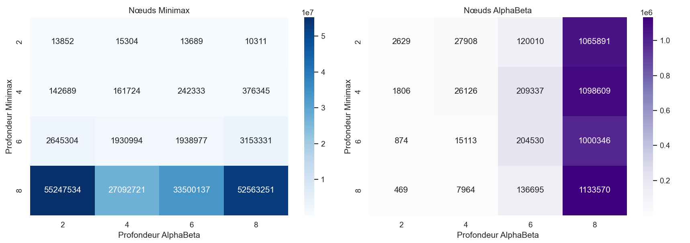
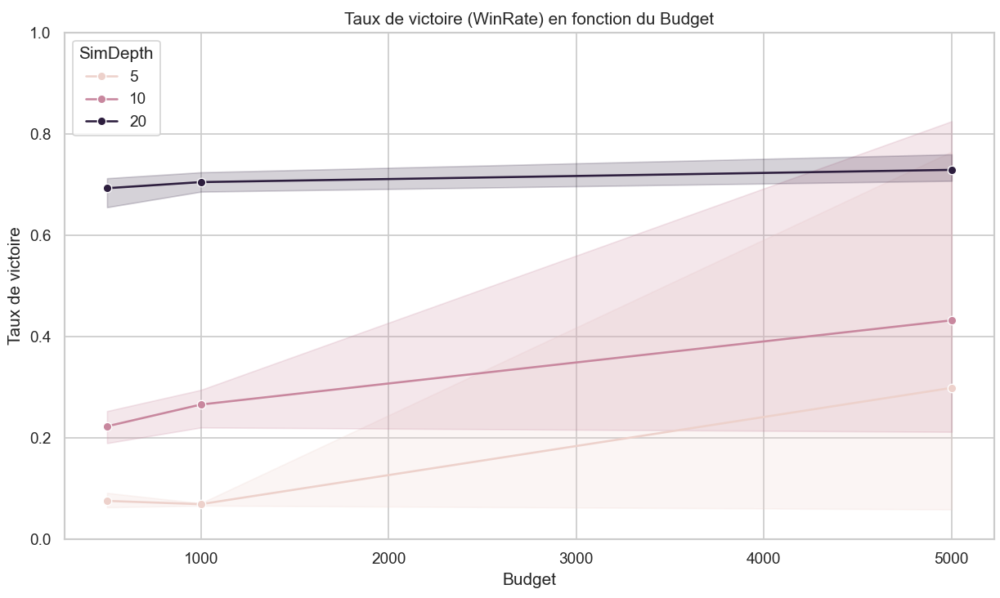
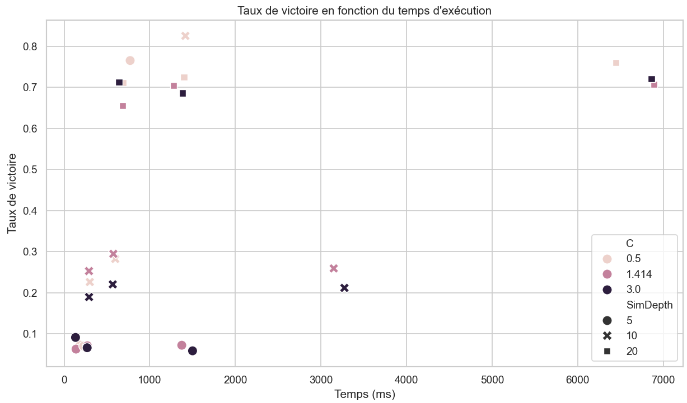
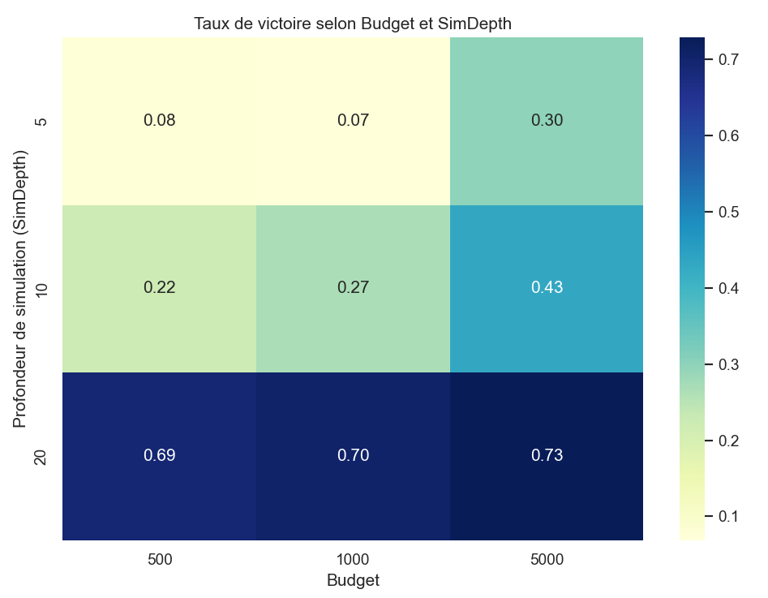
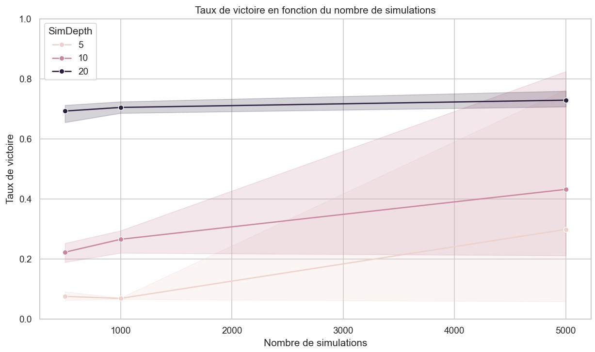

# Connect 4 and AI Algorithms: Minimax, Alpha-Beta, and MCTS
# AI Project Report: Connect 4
Work done by: Farah Ben Slama

## 1. Introduction

For this project, I chose to work on the game **Connect 4**, a classic combinatorial strategy game. It is a two-player game with complete information and no randomness, making it a good candidate for studying search algorithms. The goal is to implement and compare several AI algorithms to determine which performs best in this context.

The implemented and evaluated algorithms are:
- Minimax
- Alpha-Beta (optimized Minimax)
- MCTS (Monte Carlo Tree Search)

## 2. Game Overview

Connect 4 is an abstract combinatorial strategy game played on a 7-column by 6-row grid. Players take turns dropping a token of their color into a column of their choice. The token falls to the lowest free position in that column.

A player wins by aligning 4 tokens horizontally, vertically, or diagonally.

### 2.1 Simple Evaluation Function

This function assigns scores based on the number of aligned tokens:
* +1 for two in a row
* +10 for three in a row
* +100 for four in a row (win)

## 3. Algorithm Implementation

### 3.1 Minimax

The algorithm recursively explores possible game states up to a fixed depth. At each level, the player aims to maximize or minimize the value depending on whether they are the max or min player.

### 3.2 Alpha-Beta

This version optimizes Minimax by avoiding the exploration of unnecessary branches using alpha and beta bounds. This significantly reduces the number of nodes explored.

### 3.3 MCTS (Monte Carlo Tree Search)

MCTS works in four steps:
- Selection of a node to explore via UCB
- Tree expansion
- Simulation of a random game
- Backpropagation of the result

The algorithm favors the most promising moves according to simulated win statistics.

## 4. Game Interface

A graphical interface was developed in Java Swing. It allows:
- Human vs. human or human vs. AI play
- AI vs. AI matches
- Selecting the algorithm used for each player
- Configuring depth (for Minimax and Alpha-Beta) or number of simulations (for MCTS)

## 5. Experiments and Results

To obtain meaningful and comparable results, each algorithm incorporates randomness in move selection to avoid deterministic games, which are not useful for performance evaluation.

### 5.1 Minimax vs Alpha-Beta

Tests are in the file `TestIAProfondeurMulti.java`.  
This file automatically runs a series of Connect 4 games between two AIs: one using Minimax and the other Alpha-Beta.  
For each combination of algorithm depths, multiple games are simulated to evaluate performance based on several criteria. Results are saved in `resultats_ia.csv`.

The program measures for each configuration:
- Number of wins for Minimax and Alpha-Beta
- Number of draws
- Average computation time per move for each AI (in ms)
- Average number of nodes explored per game

Parameters:
- Number of games simulated: 5
- Depths tested: 2, 4, 6, 8
- Algorithms compared:
  * Minimax (red player)
  * Alpha-Beta (yellow player)

I ran simulations using multithreading to speed up the process, as depths 6 and 8 take a long time.

Results are exported to `resultats_ia.csv`.

Performance graphs:

## Average Execution Time

The curves and heatmaps show:

- Minimax execution time grows very quickly with depth. From depth 4, it exceeds 1 second, and at depth 8 it reaches several minutes.
- Alpha-Beta remains very fast up to depth 6. Even at depth 8, it is much faster than Minimax.
- At equal depth, Alpha-Beta is generally 10 to 1000 times faster than Minimax.

=> Alpha-Beta is much more efficient than Minimax in response time. It allows deeper searches while keeping decision time compatible with interactive play.

## Nodes Explored

Analysis of nodes explored shows:

- Minimax explores an exponentially growing number of nodes with depth. At depth 8, it exceeds 50 million nodes.
- Alpha-Beta explores far fewer nodes due to pruning, reducing the search space by a factor of 10 to 100 depending on the case.
- As depth increases, the gap between the two algorithms widens.

=> Alpha-Beta is considerably more efficient than Minimax in game tree exploration, allowing better scalability.

## Win Rate

Win rate analysis shows:

- When both algorithms play at equal depth, performance is similar in terms of wins.
- When Alpha-Beta uses higher depth, it regularly wins, even against a slower Minimax.
- The strategic advantage of Alpha-Beta is especially visible when it can search deeper than its opponent.

=> In addition to being faster, Alpha-Beta can make better decisions when allowed greater depth.

From the interpreted results, we can conclude:
- Alpha-Beta is faster than Minimax at equal depth.
- It explores far fewer nodes, allowing deeper search without exhausting resources.
- It achieves similar or better performance in game quality.

Thus, Alpha-Beta outperforms Minimax both in efficiency and strategic potential, making it the recommended choice for an AI player in a game like Connect 4.

### 5.2 MCTS Parameter Analysis

The file `TestMCTSStats.java` runs a series of tests to analyze MCTS performance under different parameters.

Three parameters are varied:
- Simulation budget: 500, 1000, 5000
- Maximum simulation depth: 5, 10, 20
- Exploration constant `C`: 0.5, √2, 3.0

For each combination:
- An initial state is generated
- The best move is selected via MCTS
- The following data are measured: chosen move, number of simulations, estimated win rate, and execution time

Results are exported to `resultats_mcts.csv`.

Performance graphs:

The figures illustrate the effect of different MCTS parameters on observed performance (measured by WinRate).

* **Impact of Budget (number of allowed simulations)**

Increasing the budget positively affects win rate, especially for low to medium simulation depths:
- At SimDepth = 5, gain is marginal but present
- At SimDepth = 10, improvement is more significant
- At SimDepth = 20, performance is already good even at low budget, but still slightly improves

This shows that higher depth allows MCTS to make better use of extra simulations.

* **Impact of Exploration Constant C**

Clear trends:
- A lower C (0.5) gives better results at high depth (SimDepth = 20), suggesting exploitation of promising nodes is preferable under a constrained budget
- Higher C values reduce performance at low depth

This confirms the importance of fine-tuning C: higher C values favor exploration but may neglect local exploitation.

* **Execution Time and Efficiency**

Scatter plot between Time(ms) and WinRate shows:
- A relatively coherent cluster for SimDepth = 20, where MCTS remains effective even with increased simulation time
- At SimDepth = 5, longer times do not significantly improve win rate

This shows that computation is better utilized at higher depths.

* **Heatmap of WinRate vs Budget and SimDepth**

- At fixed budget, increasing SimDepth clearly improves win rate
- Budget = 5000 and SimDepth = 20 achieves the best scores, confirming the combined effect of both factors

* **Effective Number of Simulations**

Graph shows a strong correlation between actual simulations and win rate, especially for SimDepth = 20
- At low depth, even a large number of simulations cannot compensate for lack of strategic information

Conclusions:
- Simulation depth is the most important factor in game quality
- Budget improves results mainly if depth is sufficient
- C should be carefully adjusted; a moderate value (like √2) is a good compromise
- Computation time is better utilized at high depth

These results confirm MCTS’s power when well-tuned, especially maximizing depth while maintaining sufficient budget.

## 5.3 MCTS vs Alpha-Beta vs Minimax

To evaluate AI performance in this Connect 4 project, automated experiments were conducted. These consist of making different AIs play against each other in simulated games with varied parameters (depth for Minimax/Alpha-Beta, simulation budget for MCTS).

**Methodology**

Each match has one AI playing red and the other yellow. For each game, the following are recorded in a CSV:
- Algorithm name
- Configuration (depth or budget)
- Winner (Red, Yellow, or Draw)
- Total execution time per AI (ms)
- Number of nodes explored or simulations performed

Tests cover:
- All combinations of Minimax, Alpha-Beta, and MCTS as red or yellow player
- Multiple depths (2, 4, 6) for Minimax and Alpha-Beta
- Simulation budgets from 100 to 5000 for MCTS
- Fixed 5 games per configuration

**Partial Results and Hypotheses**

Due to time constraints, full statistical analysis (averages, standard deviations, performance heatmaps) was not performed. Qualitative observations and hypotheses:

- Minimax without pruning explores a very large number of nodes from depth 4, causing high execution times
- Alpha-Beta behaves similarly in game quality but drastically reduces nodes explored via pruning, especially at depth ≥4
- MCTS seems faster than Minimax and Alpha-Beta at equal depth/budget, especially for moderate budgets (100–1000), but remains more stochastic. Performance depends on allowed simulations.

Reasonable assumptions:
- At low budget or depth, MCTS can compete or outperform Minimax/Alpha-Beta due to smart sampling
- At high depth, Alpha-Beta becomes clearly more efficient than Minimax
- Raw Minimax is quickly surpassed by both other algorithms as depth increases

The associated code is available in `TestIAProfondeurMulti.java`.

## 6. Conclusion

This project helped better understand search strategies in perfect-information games.  
- Alpha-Beta outperforms Minimax thanks to pruning  
- MCTS provides an effective statistical approach, especially for higher depths
